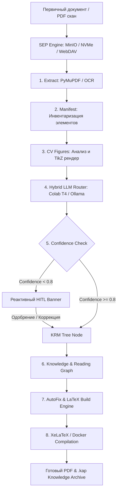

# Knowledge Assembly Engine (KAE)

<p align="center">
  
  
  
  
  
  
</p>

**Knowledge Assembly Engine (KAE)** — детерминированная высокопроизводительная система сборки, анализа и трансфигурации знаний из сложной технической документации (книги, PDF-сканы, даташиты, спецификации микропроцессорных архитектур и стандарты).

KAE преобразует неструктурированные и отсканированные первичные материалы в строго структурированные электронные артефакты, графы знаний, интерактивные векторизованные схемы TikZ и печатный LaTeX со сквозной криптографической прослеживаемостью (**Provenance**).

---

## 🌟 Ключевые возможности

- **Content-Addressed Storage (`.kap` bundles):** Кэширование и упаковывание готовых книг и разделов в иммутабельные архивы с обращением по SHA-256 хэшу содержимого.
- **Сквозная прослеживаемость (SHA-256 Provenance):** Каждое утверждение, формула, таблица и график привязаны к координатам страницы и оригинальному блоку исходного документа.
- **Storage Endpoint Providers (SEP Engine):** Унифицированный протокол абстракции источников данных для работы с NVMe SSD, корпоративными S3/MinIO бакетами, WebDAV артефактами и Google Drive.
- **Гибридный роутер нейросетей (`HybridLLMRouter`):** Автоматическое распределение тяжелых задач между облачными ускорителями (Google Colab T4/L4 GPU) и локальными энергоэффективными edge-узлами (Ollama, llama.cpp, ARM64 Pi 5 / Orange Pi CM5).
- **Реактивный HITL (Human-In-The-Loop):** Непрерывная валидация с интеграцией всплывающего интерактивного баннера для модерации и исправления узлов с низким `confidence_score` в 1 клик.
- **Компьютерное зрение и векторизация схем:** Автоматическое выделение структурных диаграмм из PDF, распознавание топологии и реконструирование чистых векторов TikZ / LaTeX.
- **Детерминированные сборки (`kae.lock`):** Полная воспроизводимость процесса сборки документации с фиксацией версий промптов, моделей и словарей.

---

## 📐 Архитектура пайплайна KAE



---

## 📑 Спецификации и стандарты (RFC 0001–0020)

Архитектура системы KAE полностью регламентирована набором стандартов RFC:

| RFC | Модуль / Спецификация | Описание |
| :--- | :--- | :--- |
| **RFC 0001** | `KRM Tree Core` | Иерархическое представление модели знаний (Knowledge Representation Model) |
| **RFC 0002** | `Knowledge Graph` | Семантический граф сущностей, мнемоник, регистров и связей |
| **RFC 0003** | `Reading Graph` | Педагогический граф последовательности прочтения и усвоения тем |
| **RFC 0004** | `Reproducible Builds` | Спецификация файла блокировки сборок `kae.lock` и детерминированных хэшей |
| **RFC 0005** | `Storage Endpoint Providers` | Абстракция протокола SEP для S3, MinIO, NVMe, WebDAV, GDrive |
| **RFC 0006** | `Content-Addressed Archive` | Формат контейнера знаний `.kap` (Knowledge Assembly Package) |
| **RFC 0007** | `pyjobkit Task Engine` | Идемпотентная распределенная очередь задач на базе SQLite/Postgres |
| **RFC 0008** | `Hybrid LLM Router` | Динамическая маршрутизация запросов (Colab GPU + Local Ollama / Claude) |
| **RFC 0009** | `CV Diagram Reconstruction` | Алгоритмы извлечения топологии схем и генерации кодовой базы TikZ |
| **RFC 0010** | `Reactive HITL Protocol` | Всплывающий протокол интервенции оператора при низком качестве сегментации |
| **RFC 0011** | `Live Glossary Engine` | Динамический словарь терминов с поддержкой Keep-As-Is правил |
| **RFC 0012** | `LaTeX Compilation Engine` | Изолированная компиляция XeLaTeX через Docker и SSH контейнеры |
| **RFC 0013** | `Provenance Audit Trail` | Дерево Меркла и SHA-256 цепочки подтверждения исходных цитат |
| **RFC 0014** | `Real-time Event SSE` | Потоковая трансляция прогресса сборки и состояния рабочей области по SSE |
| **RFC 0015** | `Unified API Gateway` | Скоростной прокси-сервер Express/FastAPI с поддержкой CORS и REST v1 |
| **RFC 0016** | `Clean Workspace Frontend` | Минималистичный двухпанельный React UI без избыточной перегруженности |
| **RFC 0017** | `Multi-Layer Translation Merge`| Слойный мёрдж переводов (Base -> AutoFix Diff -> Manual Overrides) |
| **RFC 0018** | `Code & ASM Auto-Fixer` | Автоматическая коррекция синтаксиса ассемблера 8086 и табуляций кода |
| **RFC 0019** | `Security Command Sandbox` | Песочница исполнения shell-команд и компиляции TeX документов |
| **RFC 0020** | `Remote Worker Node Specs` | Протокол подключения Colab GPU и ARM64 Edge воркеров в единую сеть |

---

## 📂 Структура проекта

```
kae-platform/
├── server.ts                    # Единый Express Gateway & API Вход (Port 3000)
├── package.json                 # Node.js зависимости & npm скрипты
├── vite.config.ts               # Конфигурация сборки Vite & React
├── pyproject.toml               # Python 3.13 конфигурация и зависимости
├── Dockerfile                   # Docker образ с XeLaTeX и кириллическими шрифтами
│
├── src/                         # Исходный код приложения
│   ├── api/                     # REST & SSE API Клиенты и Серверный роутер
│   │   ├── client.ts            # Typed KAE API Client (REST & SSE subscriptions)
│   │   └── app.py               # Python FastAPI backend подсистема
│   │
│   ├── components/              # React Компоненты Clean Workspace UI
│   │   ├── CleanWorkspace.tsx   # Двухпанельный сплит-редактор KRM & Markdown
│   │   ├── DocumentDashboard.tsx# Мониторинг документов и запуск сборок pyjobkit
│   │   ├── SEPSourcesDialog.tsx # Модальное окно подключения хранилищ SEP
│   │   ├── PipelineStepper.tsx  # Компактный индикатор выполнения пайплайна
│   │   ├── KnowledgeGraphModal.tsx # Визуализация графов знаний и связей
│   │   ├── LatexBuildView.tsx   # Предпросмотр скомпилированного LaTeX PDF
│   │   └── Header.tsx           # Лаконичная шапка с переключением экранов
│   │
│   ├── core/                    # Ядро обработки данных
│   │   ├── pipeline.py          # Оркестратор стадий сборки
│   │   ├── state.py             # Управление чекпоинтами и состоянием
│   │   ├── translator.py        # Клиент гибридного перевода и генерации
│   │   ├── validate_chapter.py  # 11 категорий автоматической валидации
│   │   ├── build_latex.py       # Генератор документов XeLaTeX
│   │   └── diagram_extract.py   # CV-модуль анализа иллюстраций и схем
│   │
│   ├── types.ts                 # Общие TypeScript интерфейсы и типы KAE
│   └── main.tsx                 # Точка входа React SPA
│
├── project.example/             # Шаблон конфигурации книги и словарей
└── colab/                       # Jupyter Notebooks для Colab GPU
    └── bookassembler_agent.ipynb
```

---

## 🚀 Быстрый старт

### Требования к окружению
- **Node.js:** `>= 18.0`
- **Python:** `>= 3.13` (обязательно для `pyjobkit`)
- **Docker:** (для локальной компиляции XeLaTeX)

### 1. Клонирование и настройка зависимостей
```bash
# Клонирование репозитория
git clone https://github.com/your-org/kae-platform.git
cd kae-platform

# Настройка виртуального окружения Python 3.13
python3.13 -m venv .venv
source .venv/bin/activate
pip install -e ".[api,dev]"

# Установка npm пакетов frontend
npm install
```

### 2. Конфигурация окружения
Скопируйте примеры конфигурационных файлов:
```bash
cp .env.example .env
cp -r project.example project
```

Отредактируйте `.env`:
```env
TRANSLATE_MODE=api
AI_PROVIDER=openai
AI_API_KEY=sk-your-api-key-here
AI_MODEL=gpt-4o
COMPILE_MODE=docker
```

### 3. Запуск платформы (Full-Stack)
Запустите единый сервер разработки на порту `3000`:
```bash
npm run dev
```
После запуска интерфейс KAE Clean Workspace будет доступен по адресу:
👉 `http://localhost:3000`

---

## 🤖 Гибридный воркер (Google Colab & Edge Nodes)

Для экономии средств и ускорения работы с тяжелыми моделями KAE поддерживает подключение внешних GPU-ускорителей:

1. Откройте `colab/bookassembler_agent.ipynb` в **Google Colab**.
2. Подключите runtime **T4 GPU** или **L4 GPU**.
3. Смонтируйте Google Drive для сохранения кэша `.kap` и промежуточных результатов.
4. Включите режим `Ollama` / `llama.cpp` серверной трансляции и укажите URL в `.env`:
   ```env
   AI_BASE_URL=https://your-colab-tunnel-url.ngrok-free.app/v1
   ```

---

## 📡 API Endpoints & Event Streaming

KAE предоставляют REST API `/api/v1/*` и поддержку Server-Sent Events (SSE):

### Хранилища SEP (Storage Endpoint Providers)
- `GET /api/v1/sep/providers` — Список подключенных источников (S3, NVMe, WebDAV).
- `POST /api/v1/sep/providers` — Регистрация нового SEP провайдера.
- `GET /api/v1/sep/providers/:id/browse` — Навигация по каталогам хранилища.
- `POST /api/v1/sep/providers/:id/import` — Запуск импорта файла в пайплайн.

### Задачи и Пайплайн (`pyjobkit`)
- `POST /api/v1/documents/upload` — Загрузка документа.
- `GET /api/v1/jobs/:job_id/status` — Текущий статус выполнения сборки.
- `GET /api/v1/jobs/stream` — SSE Поток обновлений статусов и прогресса сборок в реальном времени.

### HITL Валидация (Human-In-The-Loop)
- `GET /api/v1/hitl/pending` — Получение списка спорных узлов с низким `confidence_score`.
- `POST /api/v1/hitl/correct` — Отправка одобрения или ручной коррекции узла KRM.

### Графы знаний и структуры
- `GET /api/v1/graph/:job_id` — Получение структуры Knowledge Graph и Reading Graph.

---

## 📜 Лицензия

Проект распространяется под лицензией **MIT**. Подробности в файле [LICENSE](LICENSE).
