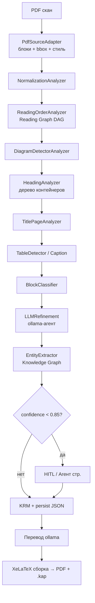

# Knowledge Assembly Engine (KAE)

<p align="center">
  
  
  
  
  
</p>

**Knowledge Assembly Engine (KAE)** превращает неструктурированные документы (в первую
очередь PDF-сканы технических книг и даташитов) в структурированную **Knowledge
Representation Model (KRM)** — дерево типизированных блоков с графами связей, из
которого можно строить переводы и целевые документы.

Вместо парадигмы «PDF → плоский текст» KAE сохраняет структуру: заголовки, таблицы,
подписи, схемы, титульные страницы, порядок чтения и семантические связи — с
привязкой каждого блока к координатам на странице.

Архитектура описана в наборе RFC (`docs/architecture/`, [аудит соответствия
кода](docs/architecture/COMPLIANCE_AUDIT.md)).

---

## Возможности

| Область | Что реализовано | Статус |
|---|---|---|
| **Извлечение (PDF)** | `PdfSourceAdapter` на PyMuPDF: блоки, стиль, bbox, фильтр OCR-мусора | ✅ |
| **Пайплайн анализа** | 10 анализаторов: нормализация, порядок чтения, заголовки, титул, таблицы, подписи, классификация, LLM-уточнение, извлечение сущностей, детекция схем | ✅ |
| **Графы** | Knowledge Graph (сущности/связи) + Reading Graph (DAG порядка чтения) | ✅ |
| **KRM round-trip** | Сохранение bbox+стиля+перевода в JSON, восстановление без потерь (RFC 0002/0011) | ✅ |
| **HITL** | Баннер low-confidence узлов, ручная правка, агент-уточнение отдельного блока | ✅ |
| **Агент на страницу** | Переклассификация и **пересборка** страницы по роли (титул/схема/таблица) | ✅ |
| **Менеджер агентов** | Несколько ollama-хостов (edge/GPU/Colab), выбор модели, роутинг | ✅ |
| **Перевод** | Постраничный фоновый перевод через ollama; источник не мутируется, lineage (RFC 0021) | ✅ |
| **Сборка книги** | XeLaTeX в Docker (кириллица) + `kae.lock`/`book.json` + `.kap` bundle (RFC 0012/0013) | ✅ |
| **Векторизация схем** | Скан-схема → TikZ: CV (OpenCV) + vision-LLM (RFC 0011 `tikz_vectorization`) | 🧪 эксперим. |
| **SEP-хранилища** | LocalFS (NVMe) рабочий; S3/MinIO, WebDAV, GoogleDrive — классы-заготовки | 🔶 частично |

---

## Пайплаин обработки



Пайплайн собирается в [`src/analyzers/pipeline.py`](src/analyzers/pipeline.py)
(`PipelineRunner` с проверкой прав анализаторов и rollback при сбое, RFC 0005).

---

## Архитектурные RFC (`docs/architecture/`)

| RFC | Тема |
|---|---|
| 0001 | Overview & Vision |
| 0002 | Knowledge Representation Model (KRM) |
| 0003 | Knowledge Graph |
| 0004 | Reading Graph |
| 0005 | Analyzer API & Permissions Matrix |
| 0006 | Skills & Recipes |
| 0007 | AI Knowledge Layer & Chunking |
| 0008 | Source Adapters |
| 0009 | Benchmark & Corpus |
| 0010 | Plugin API & Sandbox |
| 0011 | Provenance & Lineage |
| 0012 | Reproducible Builds (`kae.lock`) |
| 0013 | Artifact & Content-Addressed Store (`.kap`) |
| 0014 | Contract Testing |
| 0015 | Error Taxonomy |
| 0016 | Human-in-the-Loop |
| 0017 | Confidence Calibration |
| 0018 | Retrieval & Dataset Eval |
| 0019 | Job & Resource Manager |
| 0020 | Security & Trust |
| 0021 | Target Document Assembly & Translation |

Степень соответствия кода каждому RFC — в [`COMPLIANCE_AUDIT.md`](docs/architecture/COMPLIANCE_AUDIT.md).

---

## Структура проекта

```
BookAssembler/
├── Dockerfile               # backend (FastAPI) + frontend (Vite) + XeLaTeX (texlive)
├── docker-compose.yml       # kae-engine: порт 3000 (UI) / 8000 (API), volume /data
├── requirements.txt         # Python зависимости (fastapi, pymupdf, opencv, reportlab…)
├── server.ts                # Node gateway: раздаёт SPA + проксирует /api на FastAPI
│
├── src/
│   ├── adapters/            # PdfSourceAdapter + SEP-провайдеры (LocalFS, S3, WebDAV…)
│   ├── analyzers/           # пайплайн: normalization, reading_order, heading,
│   │                        #   title_page, table_detector, caption_analyzer,
│   │                        #   block_classifier, llm_refinement, entity_extractor,
│   │                        #   diagram_detector, pipeline (PipelineRunner)
│   ├── krm/                 # models.py — типы KRM (ContainerUnit, ParagraphBlock,
│   │                        #   TitlePageBlock, DiagramBlock, TableBlock…)
│   ├── graph/               # knowledge_graph.py, reading_graph.py
│   ├── assembler/           # translator.py, latex_builder.py, diagram_vectorizer.py
│   ├── ai_layer/            # semantic chunker + exporter (RAG)
│   ├── hitl/ jobs/ audit/   # HITL-менеджер, задачи (pyjobkit-мост), audit-лог
│   ├── api/
│   │   ├── app.py           # FastAPI: импорт, пайплайн, графы, перевод, сборка, агенты
│   │   └── client.ts        # типизированный REST/SSE клиент
│   ├── components/          # React UI (CleanWorkspace, DocumentDashboard, …)
│   └── App.tsx              # SPA
│
├── docs/architecture/       # RFC 0001–0021 + COMPLIANCE_AUDIT.md
└── colab/                   # GPU-агенты на Colab (см. ниже)
    ├── kae_gpu_agent.ipynb  # ollama (vision/coder) через cloudflared-туннель
    └── kae_got_ocr.ipynb    # GOT-OCR2.0 (таблицы/формулы) как HTTP-сервис
```

---

## Запуск (Docker)

Backend, frontend и XeLaTeX собираются в один образ.

```bash
docker compose up -d --build
```

- UI: `http://<host>:3000`
- API: `http://<host>:8000/api/v1`
- Данные (импортированные PDF, KRM-JSON, сборки): volume `/data`

Импорт: в UI **«Импорт из SEP»** → выбери PDF из подключённого LocalFS-провайдера
(по умолчанию — каталог данных на диске) → пайплайн запустится, прогресс идёт по SSE.

> Сборка фронтенда выполняется **внутри Docker** (`npm install` + `vite build` в
> Dockerfile). Локально `npm install` не требуется.

---

## GPU-агенты (Google Colab)

Тяжёлые модели (vision-векторизация схем, OCR таблиц/формул) выносятся на бесплатный
Colab-GPU и подключаются как обычный агент в менеджере агентов.

- [`colab/kae_gpu_agent.ipynb`](colab/kae_gpu_agent.ipynb) — поднимает **ollama** с
  vision-моделью (`qwen2.5vl` / `llava`) на T4 и отдаёт публичный URL через
  cloudflared. URL добавляется в менеджер агентов KAE.
- [`colab/kae_got_ocr.ipynb`](colab/kae_got_ocr.ipynb) — **GOT-OCR2.0** через
  transformers как HTTP-сервис `/ocr` (текст + Markdown/LaTeX для таблиц и формул).

Локальные ollama-агенты (Raspberry Pi / Orange Pi) работают на CPU — годятся для
классификации/перевода; для vision-задач нужен GPU (Colab).

---

## API (основное, `/api/v1`)

| Метод | Endpoint | Назначение |
|---|---|---|
| `GET` | `/sep/providers` · `/sep/providers/{id}/browse` | список/навигация хранилищ |
| `POST` | `/sep/providers/{id}/import` | импорт PDF в пайплайн |
| `GET` | `/documents` · `/jobs/{id}/result` · `/jobs/{id}/progress` | документы, KRM, прогресс |
| `GET` | `/jobs/stream` | SSE-поток прогресса |
| `GET` | `/graph/{id}` | Knowledge Graph + Reading Graph |
| `POST` | `/jobs/{id}/refine` · `/jobs/{id}/refine-page/{page}` | агент: блок / вся страница |
| `POST` | `/jobs/{id}/translate/start` · `/jobs/{id}/assemble` | перевод / сборка книги |
| `GET` | `/jobs/{id}/diagram/{block}` | рендер региона схемы |
| `GET`/`POST`/`PUT`/`DELETE` | `/agents/config` | менеджер агентов |

---

## Лицензия

MIT.
