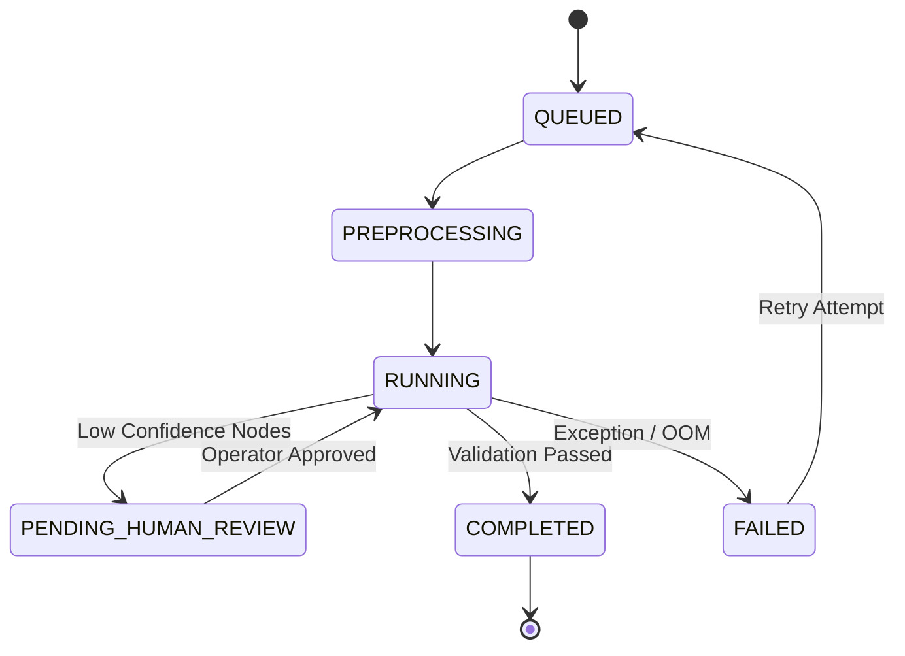

# RFC 0019: Job and Resource Manager (`pyjobkit`)

| Status | Version | Date | Author |
| :--- | :--- | :--- | :--- |
| **Accepted** | 1.0.0 | 2026-08-08 | Core Architecture Team |

---

## 1. Executive Summary

RFC 0019 specifies the background job queue engine (`pyjobkit`) and resource controller in KAE. `pyjobkit` provides idempotent task execution, progress streaming via Server-Sent Events (SSE), crash resilience, and RAM/GPU memory guardrails to prevent Out-Of-Memory (OOM) failures during heavy XeLaTeX builds or local LLM inferences.

---

## 2. Job Lifecycle & Statuses

```python
from enum import Enum

class JobStatus(str, Enum):
    QUEUED = "queued"
    PREPROCESSING = "preprocessing"
    RUNNING = "running"
    PENDING_HUMAN_REVIEW = "pending_human_review"
    COMPLETED = "completed"
    FAILED = "failed"
    CANCELLED = "cancelled"
```



---

## 3. Resource Guardrails & Limits

To prevent worker host crashes, `pyjobkit` tracks hardware limits prior to spawning subprocesses:

```python
import psutil

class ResourceGuard:
    MAX_RAM_PERCENT = 85.0
    MAX_VRAM_PERCENT = 90.0

    @classmethod
    def check_memory_available(cls) -> bool:
        mem = psutil.virtual_memory()
        return mem.percent < cls.MAX_RAM_PERCENT
```

If memory consumption exceeds $85\%$, new extraction workers are throttled and queued until system resources free up.

---

## 4. Real-time Status Streaming

Jobs emit progress updates over SSE endpoint `/api/v1/jobs/stream`:

```json
{
  "event": "job_progress",
  "job_id": "job-kae-ch04-8086",
  "progress": 0.85,
  "current_stage": "krm_assembly",
  "timestamp": "2026-08-08T12:45:00Z"
}
```
