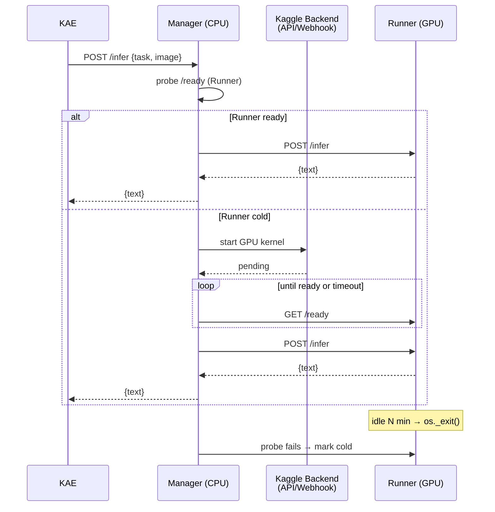

# RFC 0022: GPU Runner Orchestration (Manager / Runner split)

| Status | Version | Date | Author |
|---|---|---|---|
| Accepted | 1.0.0 | 2026-08-20 | Core Architecture Team |

> **Implementation:** all 7 stages from §10 complete. Manager and Runner services
> live in `src/agents/{manager,runner}`; KaggleKernelBackend in
> `src/agents/manager/backends/kaggle.py`; kernel notebook in
> `colab/kaggle-runner/`; KAE agent-manager routes `kind='managed'` via
> `src/agents/router.probe_managed()`. Regression suite: 80 unit tests
> (`tests/unit/test_agent_*.py`), no prod deploy required by this RFC — it
> unlocks Kaggle-hosted GPU when the operator boots the Runner notebook.

---

## 1. Executive Summary

Vision- и OCR-задачи KAE (RFC 0011 `tikz_vectorization`, RFC 0021 tables/formulas)
требуют GPU: локально на RPi5/OrangePi (CPU) они выполняются десятки минут. При
этом free-tier GPU (Kaggle T4 ≈ 30 ГПУ-часов/нед) — **дефицитный ресурс**, а KAE
работает нерегулярными всплесками (импорт документа, «Агент стр.» пользователем).

Держать GPU включённым постоянно = сжигать квоту впустую. Ручной старт/стоп
ноутбука = ненадёжно (перебои, забытые сессии).

Этот RFC описывает разделение GPU-агента на два процесса — **Manager** (всегда
доступен, дешёвый) и **Runner** (дорогой GPU, поднимается по требованию, гасится
по простою) — и контракт их взаимодействия, чтобы для остальной KAE агент выглядел
одним стабильным endpoint'ом с ролями (RFC 0005 «Analyzer API») из менеджера
агентов.

---

## 2. Роли и границы

### 2.1 Manager

- Живёт **постоянно** на CPU-хосте: Kaggle CPU-notebook (сессия 12ч) или rpi5.
- Не запускает inference сам. Держит `/health` + принимает `/infer`.
- Знает жизненный цикл Runner'а и запускает его через **backend adapter**
  (Kaggle API / GH Actions webhook / local subprocess).
- Держит **очередь запросов** пока Runner cold/warming.
- Реализует **retry, rate-limit, back-pressure**.
- Регистрируется в KAE-agent-manager как обычный агент; агент-роль сохраняется
  (`table`/`formula`/`vision`) — вся остальная KAE не отличает его от single-node
  агента.

### 2.2 Runner

- Тяжёлый процесс с VRAM: Kaggle GPU-notebook (Qwen2.5-VL, GOT-OCR, MinerU, …).
- Реализует `/health`, `/ready`, `/infer`, `/shutdown`, `/models`.
- Управляет **пулом моделей** в VRAM (lazy load + LRU-eviction по VRAM).
- Сам следит за **idle-таймером**: N минут без запросов → `os._exit(0)` (kernel
  завершается, GPU-часы больше не тикают). Manager узнаёт из следующего probe.
- **Не хранит состояние** между жизнями. Всё, что нужно на повторный запрос —
  приходит с ним (image_b64, task).

### 2.3 Что видит KAE (клиент)

Только Manager URL (в `agents.json`, `kind=managed`). Никаких Kaggle-специфик,
никаких «а если GPU выключен» — Manager абстрагирует.

---

## 3. Архитектура



---

## 4. Контракты API

### 4.1 Manager (публичный, для KAE)

- `GET /health` → `{status:"ok", kind:"managed", tasks:["table",…], runner:"ready|warming|cold|error"}`.
  KAE-agent-manager подтягивает `tasks` как «модели» и `available` из `status`.
- `POST /infer` — идентичен Runner'у по контракту: `{image_b64, task, prompt?}` →
  `{text}`. **Дополнительно** Manager соблюдает:
  - если Runner cold — стартует его, ставит запрос в очередь, отдаёт ответ когда
    готов (long-polling до `MANAGER_INFER_TIMEOUT`, default 600s);
  - если очередь переполнена → HTTP 429 с `Retry-After`;
  - при повторяющихся ошибках Runner (напр. OOM) → HTTP 503, backoff.
- `POST /ocr` — legacy alias (RFC 0021, обратная совместимость с GOT-OCR).
- `GET /metrics` (Prometheus text) — `runs_total`, `queue_depth`, `runner_up_seconds`,
  `gpu_minutes_used`.

### 4.2 Runner (внутренний, только Manager вызывает)

- `GET /health` → `{status:"ok", kind:"runner", models_loaded:[...]}` (быстрый).
- `GET /ready` → 200 когда основной набор моделей прогрет; 503 пока warming.
- `POST /infer` — как раньше.
- `POST /shutdown` → корректный выход (для «hard stop» из Manager'а).
- `GET /models` — реестр `{task→model, vram_mb, last_used_at}`.

### 4.3 Auth

Общий секрет `KAE_AGENT_TOKEN` в заголовке `Authorization: Bearer …`. Каждый
уровень (KAE↔Manager, Manager↔Runner) может иметь **свой** токен. Без токена —
`401`. Это защищает публичный cloudflared-туннель от чужого использования.

---

## 5. Оркестрация lifecycle

### 5.1 Backend-адаптеры Runner'а

Manager абстрагирует запуск через интерфейс:

```python
class RunnerBackend(Protocol):
    async def start(self) -> str: ...   # returns runner_url (tunnel)
    async def stop(self) -> None: ...
    async def status(self) -> Literal["cold", "starting", "up", "error"]: ...
```

Реализации:

- `KaggleKernelBackend` — `kaggle kernels push` (обновляет ноутбук с новым URL
  туннеля) + `kaggle kernels status` до Running; URL Runner'а Manager узнаёт
  через **служебный канал** (см. §5.2).
- `GithubActionsBackend` — webhook в GH Actions workflow, который делает то же.
- `LocalSubprocessBackend` — `docker run` / `python -m runner` на GPU-хосте
  (для собственного железа, если появится).

### 5.2 Discovery URL Runner'а

Kaggle-туннель cloudflared даёт **новый URL** при каждом запуске. Manager
должен получить его без ручного копирования. Три варианта, ранжированы:

1. **Runner PUSH** (рекомендуется): при старте Runner дёргает
   `POST {MANAGER_URL}/runner/announce {url, secret}` — минимум движущихся частей,
   Manager всегда знает текущий URL.
2. **Static tunnel** (Cloudflare Named Tunnel): URL зафиксирован, не меняется
   между запусками — но требует Cloudflare-аккаунт и токен.
3. **Kaggle log scraping** (запасной): парсить stdout kernel'а через Kaggle API —
   хрупко, не рекомендуется.

### 5.3 Warmup контракт

Runner при старте: HTTP слушает **сразу** (принимает `/health`), но `/ready` до
загрузки первичной модели отдаёт 503. Manager долбит `/ready` с backoff (0.5→5с)
до `WARMUP_TIMEOUT` (default 180s). Клиенту-KAE в это время `/infer` в очереди
или long-polling.

### 5.4 Idle shutdown

Runner держит счётчик `last_request_at`. Если `now - last > IDLE_TIMEOUT`
(default 900с) **и** очередь пуста — `os._exit(0)`. Manager при следующем
probe получит 502 → помечает `cold`.

**Rate limit восстановления:** Manager не стартует Runner чаще чем раз в
`MIN_RESTART_INTERVAL` (default 60с) — защищает Kaggle-квоту от циклов
crash-restart.

### 5.5 Failure recovery

- Runner отвечает 5xx N раз подряд → Manager делает `/shutdown` (best-effort),
  переводит в `error`, ждёт `COOLDOWN` (default 120с), пробует новый старт.
- Backend недоступен (Kaggle API 500 / нет квоты) → Manager отдаёт KAE 503 с
  человекочитаемым сообщением; в `/metrics` инкремент `backend_errors_total`.

---

## 6. Пул моделей внутри Runner

Runner держит **реестр**:

```json
{
  "table":   {"model": "GOT-OCR2.0",   "loader": "got_ocr",   "vram_mb": 6000},
  "formula": {"model": "GOT-OCR2.0",   "loader": "got_ocr",   "vram_mb": 6000},
  "vision":  {"model": "Qwen2.5-VL-7B","loader": "qwen_vl",   "vram_mb": 7000}
}
```

- **Lazy load** при первом `/infer {task}`.
- **VRAM budget** (`RUNNER_VRAM_BUDGET_MB`, авто = детект через `torch.cuda.mem_get_info`).
- **LRU eviction**: если нет места — выгружаем модель с самым старым `last_used_at`.
- **Warmup set** (env `RUNNER_WARMUP_TASKS=table,vision`) — какие модели грузить
  на старте, чтобы `/ready` был честным для этих задач.
- **Compat check** между моделями (несовместимые версии transformers):
  runner объявляет **`kind`** для каждой модели; несовместимые не грузятся в один
  процесс — тогда Manager стартует **несколько Runner'ов** и роутит по task→runner.

---

## 7. Метрики и учёт

Runner в `/metrics`:
- `infer_requests_total{task}`
- `infer_duration_seconds{task}` (histogram)
- `models_loaded{name}` (gauge, 0/1)
- `vram_used_bytes`
- `runner_up_seconds` (счётчик с момента старта kernel'а)

Manager агрегирует и считает **GPU-минуты** (кумулятивно из `runner_up_seconds`
между стартами/остановками) → выводит в `/metrics` **как основной KPI** —
сколько квоты сожжено за неделю.

Аудит-событие в KAE (`audit/logger.py`, RFC 0020): `GPU_RUNNER_STARTED`,
`GPU_RUNNER_STOPPED`, `INFER_QUEUED`, `INFER_COMPLETED` с длительностью и task'ом.

---

## 8. Интеграция с KAE

- Тип агента в `agents.json` — **`managed`** (новый, наряду с `ollama`,
  `got-ocr`, `multimodel`).
- `src/agents/router.py::_probe_agent(kind="managed")` вызывает
  `GET /health` Manager'а — там уже видно состояние Runner'а (не пингуем Runner
  сами).
- `pick(role)` работает без изменений: managed-агент декларирует `roles`.
- В UI менеджера агентов — бейдж **«MANAGED»** + мелкий индикатор состояния
  runner (`⚡ ready` / `🟡 warming` / `⚪ cold`).

---

## 9. Инварианты

1. **Прозрачность для KAE:** KAE не знает про Kaggle, kernel'ы, туннели —
   только Manager URL и `/infer`.
2. **Один runner в один момент** (per Manager). Пул нескольких — отдельный
   RFC, сейчас out-of-scope.
3. **Учёт GPU-минут обязателен** — если `/metrics` не отдаёт `gpu_minutes_used`,
   Manager не деплоится.
4. **Idle shutdown обязателен** — Runner без idle-таймера не деплоится (защита
   от забытых сессий).
5. **Auth обязательна** — публичный туннель без токена не принимает запросы
   (не позволить чужим сжигать нашу GPU-квоту).
6. **Детерминизм LLM (RFC 0012 §3.1):** Runner соблюдает `temperature=0, seed=42`
   как раньше; Manager не переопределяет.

---

## 10. План реализации (по этапам)

1. ✅ **`src/agents/manager/`** (commit `509b0e7`) — FastAPI, `python -m
   src.agents.manager`, env-driven config, state machine, orchestrator,
   Bearer auth, Prometheus `/metrics`, 8 tests.
2. ✅ **`src/agents/runner/`** (commit `81ccbd3`) — model pool with lazy load
   and LRU-eviction under a VRAM budget, warmup → `/ready`, idle watchdog
   (`os._exit(0)`), push announce, 14 tests.
3. ✅ **`KaggleKernelBackend`** (commit `ed57a6b`) via the `kaggle` Python
   API (optional runtime dep, lazy import); `colab/kaggle-runner/`
   kernel-metadata + runner.ipynb; 8 tests.
4. ✅ **Announce hardening** (commit `70a3459`) — URL validation
   (no loopback/private/link-local unless `allow_local`), same-URL
   idempotency, distinct-URL rate limit, Runner-side retry with
   exponential backoff and 4xx early stop; 29 tests.
5. ✅ **Audit + метрики** (commit `568b876`) — shared `AgentAudit`
   (hash-chained JSONL, RFC 0020 format) with typed event helpers on both
   Manager and Runner; extended Prometheus counters
   (`kae_auth_fail_total`, `kae_announce_{total,rejected_total}`,
   `kae_runner_*`); 10 tests.
6. ✅ **UI `kind=managed`** (commit `dffc708`) — MANAGED badge + live
   Runner-state indicator in the agent-manager modal; router refuses to
   route to a managed agent whose Runner isn't UP; 5 tests.
7. ✅ **RFC compliance** — this file's status flipped Draft → Accepted;
   `COMPLIANCE_AUDIT.md` marks 0022 as ✅.

Разбиение на этапы было соблюдено: до конца этапа 4 ни один Manager/Runner
не деплоился в прод (см. `feedback_quality_over_speed`).
