# Карта сущностей KRM: объявлено vs используется vs пропущено

| Статус | Версия | Дата |
|---|---|---|
| Draft | 0.4.0 | 2026-08-26 |

Инвентаризация всех типов узлов Knowledge Representation Model (см. RFC 0002) —
что объявлено в `src/krm/models.py`, что реально создаётся в пайплайне (и кем),
и чего пока не хватает для честного покрытия структуры технической книги.

**Легенда:**
- ✅ — объявлен и создаётся хотя бы одним анализатором/адаптером
- ⚠️ — объявлен, но никто его не создаёт (мёртвый тип)
- ❌ — тип отсутствует, семантика «размазана» по строковым флагам или ParagraphBlock

---

## 1. Слой Layout / Meta

| Тип | Статус | Кем создаётся |
|---|---|---|
| `NormalizedRect` | ✅ | все адаптеры и анализаторы через `VisualLayout.bounding_box` |
| `StyleDescriptor` | ✅ | `PdfSourceAdapter` (шрифт/кегль/жир/курсив/цвет) |
| `VisualLayout` | ✅ | адаптеры |
| `ProvenanceInfo` | ✅ | `PipelineRunner` (RFC 0005 §5) |

## 2. Слой Inline (`SpanUnit`, `InlineUnit`)

| Тип | Статус | Кем создаётся / почему нет |
|---|---|---|
| `StyledTextSpan` | ✅ | `PdfSourceAdapter` (`pdf_adapter.py:318`) |
| `TextLineInline` | ✅ | `PdfSourceAdapter` (`pdf_adapter.py:328`) |
| `EntityMentionSpan` | ⚠️ | `EntityExtractor` вместо создания span'а пишет `entity_mentions` в `span.metadata` |
| `FootnoteRefSpan` | ⚠️ | нет детектора сносок |
| `MathInline` | ⚠️ | нет детектора inline-формул |

## 3. Слой Structural (`StructuralUnit`)

| Тип | Статус | Кем создаётся / почему нет |
|---|---|---|
| `ParagraphBlock` | ✅ | адаптеры (`pdf_adapter`, `text_markdown`) |
| `TitlePageBlock` | ✅ | `TitlePageAnalyzer` |
| `BlankPageBlock` | ✅ | `TitlePageAnalyzer` (`title_page.py:190`) |
| `TableBlock` + `TableCell` | ✅ | `TableDetector`, `PageAgent` (пересборка LaTeX) |
| `FigureBlock` | ✅ | `PdfSourceAdapter` (`pdf_adapter.py:224`) |
| `DiagramBlock` | ✅ | `DiagramDetectorAnalyzer` |
| `CodeBlock` | ✅ | `PdfSourceAdapter`, `text_markdown` |
| `CaptionBlock` | ✅ | `CaptionAnalyzer` |
| `FormulaBlock` | ✅ | `FormulaDetectorAnalyzer` (эвристика: math-font или ≥15% math-символов; заглушку заменит vision-OCR) |
| `ListBlock` / `ListItemBlock` | ✅ | `ListDetectorAnalyzer` (маркеры •/-/1./a)/iv.) |
| `TocEntryBlock` | ✅ | `BlockClassifierAnalyzer` + PageAgent (парсит номер главы и целевую страницу; `_link_toc_anchors` привязывает к контейнерам заголовков) |
| `InstructionSpec` | ⚠️ | `EntityExtractor` даёт KG-ноду `INSTRUCTION`, но не структурный блок |
| `DefinitionSpec` | ✅ | `DefinitionDetectorAnalyzer` — prefix + pattern heuristics |
| `WarningSpec` | ⚠️ | то же самое |
| `FootnoteBlock` | ✅ | `FootnoteDetectorAnalyzer` (маркер + маленький кегль + низ страницы) |
| `CalloutBlock` (note/warning/tip) | ✅ | `CalloutDetectorAnalyzer` (префикс Note/Warning/⚠/…) → mdframed |
| `SidebarBlock` | ❌ | боковой блок сливается с основным потоком |
| `BibEntryBlock` | ✅ | `BibliographyDetectorAnalyzer` (контейнер «Bibliography/References/Литература») → `thebibliography` |
| `IndexEntryBlock` | ❌ | предметный указатель — обычные параграфы |
| `AlgorithmBlock` | ❌ | псевдокод неотличим от `CodeBlock` |
| `TheoremSpec` (Theorem/Lemma/Corollary/Proposition) | ✅ | `TheoremDetectorAnalyzer` — prefix detection |
| `ProofSpec` | ✅ | `TheoremDetectorAnalyzer` — proof prefix + links to proved statement |
| `ExampleSpec` | ✅ | `TheoremDetectorAnalyzer` — example prefix detection |
| `RemarkSpec` | ✅ | `TheoremDetectorAnalyzer` — remark prefix detection |
| `EphemeraBlock` (pagenum / running header / footer) | ❌ | сейчас автоматически tombstone'ятся `title_page` эвристикой, но своего типа нет |

## 4. Слой Container

| Тип | Статус | Комментарий |
|---|---|---|
| `ContainerUnit` (part/chapter/section/…) | ✅ | `HeadingAnalyzer` строит дерево |
| `ContainerUnit(semantic_type='toc')` | ✅ | `BlockClassifier`, `PageAgent` (`block_classifier.py:228`) |
| `ContainerUnit(semantic_type='example')` | ✅ | `CaptionAnalyzer` (`caption_analyzer.py:112`) |
| `KnowledgeDocument` (root) | ✅ | адаптер |

`semantic_type` — единственный на данный момент способ дать контейнеру
подтип. Значения — свободные строки, документированного словаря нет.

## 5. Knowledge Graph — типы сущностей (`EntityType`)

| Тип | Статус | Комментарий |
|---|---|---|
| `REGISTER` | ✅ | regex на `R0..R15` в `EntityExtractor` |
| `INSTRUCTION` | ✅ | regex на MOV/ADD/… в `EntityExtractor` |
| `CONCEPT_TERM` | ✅ | hex-литералы, fallback |
| `HARDWARE_COMPONENT` | ⚠️ | объявлен, детектора нет |
| `FLAG` | ⚠️ | объявлен, детектора нет |
| `SOFTWARE_API` | ⚠️ | объявлен, детектора нет |
| `BIBLIOGRAPHY_CITE` | ⚠️ | объявлен, детектора нет |
| `Person` / `Organization` / `Product` / `Signal` / `Date` / `Version` / `URL` / `Formula` / `Unit` | ❌ | не объявлены |

## 6. Knowledge Graph — типы связей (`RelationType`)

| Тип | Статус |
|---|---|
| `MENTIONS_ENTITY` | ✅ используется |
| `REFERENCES` / `CAPTION_FOR` / `FOOTNOTE_FOR` / `CONTINUATION_OF` / `DEFINES_ENTITY` / `CONCRETIZES` / `EXEMPLIFIES` / `USES_REGISTER` / `AFFECTS_FLAG` / `PART_OF_ARCHITECTURE` | ⚠️ объявлены, никем не пишутся |
| `authored_by` / `published_in` / `cites` / `version_of` / `alias_of` | ❌ отсутствуют |

---

## Целевая иерархия KRM

```mermaid
graph TD
    Base["BaseKRMNode<br/>(id, visual_layout, confidence, tombstone, metadata)"]

    Base --> Span["SpanUnit (inline фрагмент)"]
    Span --> StyledSpan["StyledTextSpan ✅"]
    Span --> MentionSpan["EntityMentionSpan ⚠️"]
    Span --> FootRefSpan["FootnoteRefSpan ⚠️"]

    Base --> Inline["InlineUnit"]
    Inline --> TextLine["TextLineInline ✅"]
    Inline --> MathInl["MathInline ⚠️"]

    Base --> Struct["StructuralUnit (ABC)"]
    Struct --> Para["ParagraphBlock ✅"]
    Para --> Title["TitlePageBlock ✅"]
    Struct --> ListB["ListBlock ✅"]
    ListB --> ListIt["ListItemBlock ✅"]
    Struct --> Table["TableBlock ✅"]
    Struct --> Fig["FigureBlock ✅"]
    Fig --> Diag["DiagramBlock ✅"]
    Struct --> Code["CodeBlock ✅"]
    Struct --> Formula["FormulaBlock ✅"]
    Struct --> Cap["CaptionBlock ✅"]
    Struct --> Blank["BlankPageBlock ✅"]
    Struct --> Callout["CalloutBlock ✅<br/>note/warning/tip"]
    Struct --> Foot["FootnoteBlock ✅"]
    Struct --> BibE["BibEntryBlock ✅"]
    Struct --> IdxE["IndexEntryBlock ❌"]
    Struct --> TocE["TocEntryBlock ✅"]
    Struct --> Algo["AlgorithmBlock ❌"]
    Struct --> Eph["EphemeraBlock ❌<br/>pagenum/header/footer"]

    Base --> Sem["SemanticUnit (декоратор ABC)"]
    Sem --> Def["DefinitionSpec ✅"]
    Sem --> Thm["TheoremSpec ✅"]
    Sem --> Proof["ProofSpec ✅"]
    Sem --> Ex["ExampleSpec ✅"]
    Sem --> Rem["RemarkSpec ✅"]
    Sem --> Instr["InstructionSpec ⚠️"]
    Sem --> Warn["WarningSpec ⚠️"]

    Base --> Cont["ContainerUnit<br/>(chapter/section/toc/example)"]
    Cont --> Doc["KnowledgeDocument (root)"]

    classDef ok fill:#dcfce7,stroke:#166534,color:#052e16
    classDef warn fill:#fef9c3,stroke:#854d0e,color:#422006
    classDef miss fill:#fee2e2,stroke:#991b1b,color:#450a0a
    classDef abstract fill:#e0e7ff,stroke:#3730a3,color:#1e1b4b

    class Base,Span,Inline,Struct,Sem,Cont abstract
    class StyledSpan,TextLine,Para,Title,Table,Fig,Diag,Code,Cap,Blank,Doc ok
    class ListB,ListIt,Formula,TocE,Callout,Foot,BibE ok
    class MentionSpan,FootRefSpan,MathInl,Def,Instr,Warn warn
    class IdxE,Algo,Eph,Thm,Proof,Ex,Rem miss
```

---

## Приоритетный план закрытия пробелов

**P0 — ✅ ВЫПОЛНЕНО:**
1. ✅ `ListBlock` / `ListItemBlock` + `ListDetectorAnalyzer` — маркеры
   •/-/1./a)/iv., сериализация, LaTeX itemize/enumerate, чанкер
   атомарный (RFC 0007 §5.2). 7 unit-тестов.
2. ✅ `TocEntryBlock` (chapter_number, target_page, anchor_id) —
   `BlockClassifierAnalyzer._parse_toc_entry` + PageAgent-путь;
   `_link_toc_anchors` привязывает записи к ContainerUnit заголовков.
   5 unit-тестов.
3. ✅ `FormulaBlock` + `FormulaDetectorAnalyzer` — эвристика по
   math-font (CMMI/CMSY/STIX/…) и плотности math-символов; fallback
   помечен `needs_vision_ocr` для GOT-OCR / Qwen-VL. 7 unit-тестов.

**P1 — ✅ ВЫПОЛНЕНО:**
4. ✅ `CalloutBlock` — префикс Note/Warning/Tip/⚠/Внимание, `mdframed`
   в LaTeX, атомарный в чанкере. 7 тестов.
5. ✅ `FootnoteBlock` — маркеры ¹²³/1./*/†, small-font + bottom-y
   эвристика, tests+false-positives. 8 тестов.
6. ✅ `BibEntryBlock` — контейнеры «Bibliography/References/Литература»,
   парс `[N]`/года/авторов, `thebibliography` в LaTeX. 7 тестов.

**P2 — семантические декораторы для математического текста:**
7. `TheoremSpec` / `ProofSpec` / `ExampleSpec` / `RemarkSpec` — расширение
   `SemanticUnit`; детектор — эвристикой по заголовкам «Теорема N.M», «□»
   в конце proof, «Пример N».
8. Расширение `EntityType` — `Person`, `Organization`, `Product`,
   `BibliographyCite` (уже объявлен, но не пишется), `Signal`, `Formula`.

**P3 — служебное:**
9. `EphemeraBlock` вместо неявного tombstone — явный тип для колонтитулов
   и номеров страниц (сейчас логика размазана по `TitlePageAnalyzer`).
10. `AlgorithmBlock` — специализация `CodeBlock` для нумерованного
    псевдокода (стандарт `algorithmicx` в LaTeX-сборке).

## Что делать со «⚠️ объявлено, не создаётся»

Три варианта, в порядке предпочтения:
- **добавить анализатор** (для `FormulaBlock`, `DefinitionSpec`, `WarningSpec` — это правильный путь);
- **удалить неиспользуемый тип** (если целесообразности нет — например,
  `FootnoteRefSpan` можно оставить как атрибут `metadata['footnote_id']` у
  span'а, а сам класс убрать);
- **переиспользовать** (`InstructionSpec` — либо детектор, либо явно снести
  и полагаться только на KG-ноду).

Решение принимать по каждому пункту отдельно после закрытия P0/P1.

---

## Связанные RFC

- [RFC 0002 — KRM](0002-krm.md) — контракт типов
- [RFC 0003 — Knowledge Graph](0003-knowledge-graph.md) — `EntityType` / `RelationType`
- [RFC 0008 — Source Adapters](0008-source-adapters.md) — правило «адаптер без бизнес-логики»
- [COMPLIANCE_AUDIT.md](COMPLIANCE_AUDIT.md) — общая карта соответствия
